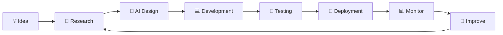

<div align="center">


<br/>


<br/>


</div>

---

# 👋 Hello, I'm Likesh Kanna

### 🚀 Applied AI Engineer • AI Agent Developer • Backend Developer • Founder @ ScrapSail

I'm a Computer Science (AI & ML) student passionate about building practical AI systems that solve real-world problems.

My primary interests include Artificial Intelligence, Large Language Models, AI Agents, Backend Engineering, and scalable software systems.

Currently, I'm building **ScrapSail**, an AI-powered smart scrap collection platform focused on making recycling more efficient through automation and intelligent technologies.

> **Mission**
>
> Build AI-powered software that creates measurable real-world impact through intelligent automation.

---

# 🧠 AI Dashboard

| Category | Status |
|----------|--------|
| 👤 Name | **Likesh Kanna** |
| 💼 Role | Applied AI Engineer |
| 🎓 Degree | B.Tech CSE (AI & ML) |
| 🚀 Startup | ScrapSail |
| 🌍 Location | Tamil Nadu, India |
| ☕ Backend | Spring Boot |
| 🤖 AI | LLMs • AI Agents • RAG |
| 🐍 Languages | Python • Java |
| 🗄 Database | MySQL |
| 🐳 DevOps | Docker • GitHub Actions |
| 📚 Learning | LangChain • MCP • Vector Databases |
| 🎯 Goal | Build production-ready AI applications |

---

# 🚀 Current Focus

```text
🟢 Building
└── ScrapSail

🟢 Learning
├── Large Language Models
├── AI Agents
├── Retrieval-Augmented Generation (RAG)
├── LangChain
├── MCP
├── Vector Databases
└── Spring AI

🟢 Improving
├── Java
├── Python
├── Spring Boot
├── System Design
├── Docker
└── Open Source Contributions
```

---

# 📅 2026 Goals

- [ ] Launch ScrapSail MVP
- [ ] Build production-ready AI projects
- [ ] Master LLM application development
- [ ] Learn AI Agent architectures
- [ ] Become proficient in Spring Boot
- [ ] Contribute consistently to Open Source
- [ ] Build a strong GitHub portfolio
- [ ] Prepare for Applied AI Engineer roles

---

# 💡 Engineering Philosophy

```text
Learn consistently.

Build practical projects.

Ship complete products.

Improve every iteration.

Repeat.
```

I believe engineering is not about knowing every technology—it's about solving meaningful problems with clean, maintainable software.

---

# ⚡ Quick Snapshot

🎓 B.Tech Computer Science (AI & ML)

🤖 Applied AI & LLM Enthusiast

☕ Java Backend Developer

🐍 Python Developer

🚀 Founder of ScrapSail

📚 Continuous Learner

🌱 Open Source Contributor

💡 Passionate about solving real-world problems with AI

---

# 📫 Connect With Me

<div align="center">

<a href="mailto:likeshkanna74@gmail.com">

</a>

<a href="https://www.linkedin.com/in/likesh-kanna-77467b30b">

</a>

<a href="https://github.com/Likesh1235">

</a>

</div>

---

<div align="center">

> **"Building AI systems that solve real-world problems, one project at a time."**

</div>

---

<!-- ========================= -->
<!-- PART 2 STARTS HERE -->
<!-- ========================= -->
<!-- ====================================================== -->
<!--                 PART 2 : TECH STACK                    -->
<!-- ====================================================== -->

# ⚡ Tech Stack

<div align="center">

## 👨‍💻 Programming Languages

<p>

</p>

---

## 🤖 Artificial Intelligence & Machine Learning

<p>

</p>

<p>


</p>

---

## ☕ Backend Development

<p>


</p>

---

## 🗄 Databases

<p>


</p>

---

## ☁️ Cloud & DevOps

<p>


</p>

---

## 🛠 Development Tools

<p>


</p>

</div>

---

# 🧠 Core Areas of Interest

<table>

<tr>

<td width="50%">

### 🤖 Artificial Intelligence

- AI Agents
- Large Language Models
- Prompt Engineering
- Retrieval-Augmented Generation
- LangChain
- AI Automation

</td>

<td width="50%">

### ☕ Software Engineering

- Spring Boot
- REST APIs
- Backend Development
- Clean Architecture
- System Design
- API Integration

</td>

</tr>

</table>

---

# 🎯 Currently Learning

```text
███████████████████░░░░░░ 80%

✔ Python for AI

████████████████░░░░░░░░░ 70%

✔ Spring Boot

██████████████░░░░░░░░░░░ 60%

✔ LLM Applications

████████████░░░░░░░░░░░░░ 50%

✔ AI Agents

██████████░░░░░░░░░░░░░░░ 40%

✔ LangChain

█████████░░░░░░░░░░░░░░░░ 35%

✔ MCP

████████░░░░░░░░░░░░░░░░░ 30%

✔ Vector Databases
```

---

# 🔬 Current Research

```yaml
Artificial Intelligence:
  - AI Agents
  - Large Language Models
  - Retrieval-Augmented Generation
  - Prompt Engineering
  - AI Workflows

Backend:
  - Spring Boot
  - REST APIs
  - Authentication
  - JWT
  - MySQL

Software Engineering:
  - Clean Code
  - Design Patterns
  - System Design
  - GitHub Actions

Startup:
  - ScrapSail
  - AI Automation
  - Smart Waste Management
```

---

# 🚀 What I'm Building

## 🚀 ScrapSail

> AI-powered smart scrap collection platform.

### Current Features

- Smart pickup requests
- User authentication
- AI-ready architecture
- GPS integration
- Smart dashboard
- Backend APIs
- Future AI-based waste classification

---

# 📚 Learning Roadmap

## 2026

- ✅ Advanced Python
- ✅ Spring Boot
- 🔄 Docker
- 🔄 LangChain
- 🔄 AI Agents
- 🔄 MCP
- 🔄 Vector Databases
- 🔄 System Design
- 🔄 Open Source Contributions

---

<div align="center">

## ⚙️ Engineering Principles

💡 Build useful software

🧹 Write clean code

📖 Learn continuously

🤝 Share knowledge

🚀 Ship real projects

</div>

---

<!-- ====================================================== -->
<!--               PART 3 STARTS BELOW                      -->
<!-- ====================================================== -->
<!-- ====================================================== -->
<!--                 PART 3 : GITHUB ANALYTICS              -->
<!-- ====================================================== -->

# 📊 GitHub Analytics

<div align="center">


</div>

---

# 🔥 GitHub Streak

<div align="center">


</div>

---

# 📈 Contribution Activity

<div align="center">


</div>

---

# 🏆 GitHub Trophy Wall

<div align="center">


</div>

---

# 🐍 Contribution Snake

<div align="center">


</div>

---

# 📅 Contribution Calendar

<div align="center">


</div>

---

# 📌 GitHub Snapshot

<div align="center">

| Metric | Description |
|---------|-------------|
| ⭐ Public Repositories | AI, Java, Backend & Open Source Projects |
| 🤝 Open Source | Learning through contributions and collaboration |
| 🚀 Current Focus | Applied AI Engineering & ScrapSail |
| 📈 Daily Goal | Build • Learn • Commit |
| 🎯 Career Goal | Applied AI Engineer |

</div>

---

# 📈 Contribution Philosophy

```text
Every commit represents progress.

Small improvements made consistently
lead to significant engineering growth.
```

---

<div align="center">

### 🚀 Consistency > Perfection

> "The best GitHub profile isn't the one with the most commits.
> It's the one that demonstrates continuous learning and real projects."

</div>

---

<!-- ====================================================== -->
<!--                 PART 4 STARTS BELOW                    -->
<!-- ====================================================== -->
<!-- ====================================================== -->
<!--                PART 4 : FEATURED PROJECTS              -->
<!-- ====================================================== -->

# 🚀 Featured Projects

> Real projects that reflect my journey in **Applied AI**, **Backend Engineering**, and **Software Development**.

---

## 🌟 Featured Project

<div align="center">

# 🚀 ScrapSail

### AI-Powered Smart Scrap Collection Platform

*Transforming waste collection using Artificial Intelligence, automation, and modern backend technologies.*

<br>


</div>

---

## 📌 Overview

ScrapSail is an AI-powered platform designed to modernize the scrap collection process through automation, intelligent workflows, and scalable backend systems.

The vision is to make recycling more accessible, efficient, and data-driven.

---

## ✨ Current Features

- User Registration & Authentication
- Scrap Pickup Requests
- Dashboard
- Backend REST APIs
- MySQL Database
- Spring Boot Backend
- AI-ready Architecture

---

## 🔮 Planned Features

- AI Waste Classification
- LLM-powered Customer Assistant
- Route Optimization
- Smart Pickup Scheduling
- GPS Tracking
- AI Analytics Dashboard
- Carbon Impact Calculator
- Mobile Application

---

## 🛠 Technology Stack

| Category | Technologies |
|-----------|--------------|
| Backend | Java, Spring Boot |
| Database | MySQL |
| AI | TensorFlow, LLM APIs |
| Authentication | JWT |
| Version Control | Git & GitHub |
| Deployment | Docker (Learning) |

---

# 📂 Other Projects

---

## 🐍 Python Practice Repository

> Comprehensive Python repository covering beginner to advanced programming concepts.

### Topics

- Variables
- Loops
- Functions
- OOP
- File Handling
- Exception Handling
- Decorators
- Iterators
- Generators
- Context Managers
- Collections
- Python Projects

---

## ☕ Java Practice Repository

> Java programming repository focused on object-oriented programming and backend fundamentals.

### Topics

- OOP
- Inheritance
- Polymorphism
- Encapsulation
- Abstraction
- Collections
- Exception Handling
- Multithreading
- File Handling

---

## 🤖 AI Engineering Roadmap

A structured repository documenting my journey towards becoming an Applied AI Engineer.

Topics include:

- Python for AI
- Machine Learning
- Deep Learning
- LLMs
- RAG
- AI Agents
- MLOps
- Backend Engineering
- System Design

---

# 🎯 Current Learning Projects

<div align="center">

| Project | Status |
|---------|---------|
| AI Agent Framework | 🟡 In Progress |
| Spring Boot APIs | 🟡 In Progress |
| LangChain Experiments | 🟡 In Progress |
| RAG System | 🔜 Planned |
| MCP Integration | 🔜 Planned |
| Docker Deployment | 🟡 Learning |

</div>

---

# 📈 2026 Project Roadmap

```text
✅ Python Practice Repository

↓

✅ Java Backend Projects

↓

🚀 ScrapSail MVP

↓

🤖 AI Agent Projects

↓

🧠 Production RAG System

↓

📦 Open Source AI Libraries

↓

🌍 Production AI Products
```

---

# 💡 Project Philosophy

> I believe that strong software engineering comes from **building complete, real-world projects** rather than collecting certificates or tutorials.

Every repository I publish represents a step toward becoming a better engineer through practical experience.

---

<div align="center">

### ⭐ More projects are coming soon as I continue learning and building.

</div>

---

<!-- ====================================================== -->
<!--                 PART 5 STARTS BELOW                    -->
<!-- ====================================================== -->
<!-- ====================================================== -->
<!--            PART 5 : AI TERMINAL & FUTURE               -->
<!-- ====================================================== -->

# 💻 AI Terminal

```bash
┌──────────────────────────────────────────────────────────────┐
│                    AI NEXUS TERMINAL                         │
└──────────────────────────────────────────────────────────────┘

likesh@ai:~$ whoami
Likesh Kanna

likesh@ai:~$ role
Applied AI Engineer

likesh@ai:~$ education
B.Tech Computer Science Engineering
Specialization: Artificial Intelligence & Machine Learning

likesh@ai:~$ startup
ScrapSail

likesh@ai:~$ current_focus

✓ Applied Artificial Intelligence
✓ Large Language Models
✓ AI Agents
✓ Retrieval-Augmented Generation
✓ Backend Development
✓ Spring Boot
✓ Docker
✓ Open Source

likesh@ai:~$ current_stack

Languages:
Python
Java
SQL

Backend:
Spring Boot
REST APIs

AI:
TensorFlow
LangChain
LLMs
Prompt Engineering

Database:
MySQL

Tools:
Git
GitHub
VS Code
Postman

likesh@ai:~$ life_goal

Build AI products that solve real-world problems.

likesh@ai:~$ status

🟢 BUILDING...

_
```

---

# 🔬 Research Interests

<div align="center">

| AI | Backend | Software Engineering |
|:---:|:---:|:---:|
| 🤖 AI Agents | ☕ Spring Boot | 🏗 Clean Architecture |
| 🧠 LLMs | 🔐 Authentication | 📦 System Design |
| 📚 RAG | ⚡ REST APIs | 🧪 Testing |
| 💬 Prompt Engineering | 🗄 MySQL | 🔄 CI/CD |
| 🧩 AI Automation | 🐳 Docker | 🌐 Scalable Systems |

</div>

---

# 📖 Currently Learning

```text
Artificial Intelligence
███████████████████████░░░ 90%

Python
████████████████████░░░░░░ 85%

Java
███████████████████░░░░░░░ 80%

Spring Boot
████████████████░░░░░░░░░░ 70%

LangChain
█████████████░░░░░░░░░░░░░ 60%

AI Agents
████████████░░░░░░░░░░░░░░ 55%

Docker
██████████░░░░░░░░░░░░░░░░ 45%

System Design
████████░░░░░░░░░░░░░░░░░░ 35%
```

---

# 🎓 Certifications

| Certificate | Status |
|-------------|--------|
| Python Programming | ✅ Completed |
| NPTEL Programming in Java | ✅ Completed |
| AI & ML Courses | 🔄 Ongoing |
| Spring Boot | 🔄 Learning |
| Docker | 🔄 Learning |

---

# 🌱 Open Source Journey

My goal is to become an active contributor to the open-source community by:

- Improving existing projects
- Fixing bugs
- Writing documentation
- Building developer tools
- Publishing AI-related utilities
- Sharing learning resources

---

# 🗺 Career Roadmap

```text
B.Tech AI & ML
        │
        ▼
Advanced Python
        │
        ▼
Java Backend
        │
        ▼
Spring Boot
        │
        ▼
Applied AI
        │
        ▼
LLMs
        │
        ▼
AI Agents
        │
        ▼
Production AI Systems
        │
        ▼
Applied AI Engineer
```

---

# 🎯 2026 Goals

- ✅ Build a strong GitHub portfolio
- 🚀 Launch ScrapSail MVP
- 🤖 Build AI-powered applications
- 📚 Master Applied AI Engineering
- ☕ Become proficient in Spring Boot
- 🧠 Learn advanced LLM architectures
- 🌍 Contribute to Open Source
- 📈 Maintain consistent GitHub contributions

---

# 📫 Let's Connect

<div align="center">

<a href="mailto:likeshkanna74@gmail.com">

</a>

<a href="https://www.linkedin.com/in/likesh-kanna-77467b30b">

</a>

<a href="https://github.com/Likesh1235">

</a>

</div>

---

# 💬 Favorite Quote

<div align="center">

> **"Great software isn't built by knowing every technology. It's built by solving real problems with the right technology."**

</div>

---

<div align="center">

## ⭐ Thanks for visiting my profile!

If you're interested in **Applied AI**, **Backend Engineering**, **AI Agents**, or **Open Source**, I'd love to connect and learn together.


</div>

<!-- ====================================================== -->
<!--                 README MAIN CONTENT END                -->
<!-- ====================================================== -->
<!-- ====================================================== -->
<!--              PART 6 : LIVE WIDGETS & FOOTER            -->
<!-- ====================================================== -->

# 🌐 Developer Ecosystem

<div align="center">

### ⚡ Engineering Principles

<table>
<tr>
<td align="center" width="25%">

### 🤖 AI First

Building practical AI solutions using modern LLMs and AI Agents.

</td>

<td align="center" width="25%">

### ☕ Clean Code

Readable, scalable and maintainable software over shortcuts.

</td>

<td align="center" width="25%">

### 🚀 Build Fast

Learn → Build → Test → Improve → Repeat

</td>

<td align="center" width="25%">

### 🌍 Open Source

Learning by building and contributing consistently.

</td>
</tr>
</table>

</div>

---

# 📊 Development Activity

<div align="center">


<br><br>


<br><br>


</div>

---

# 🗂 Repository Highlights

<div align="center">

| Repository | Description |
|------------|-------------|
| 🚀 ScrapSail | AI-powered smart scrap collection platform |
| 🐍 Python Practice | Python from fundamentals to advanced concepts |
| ☕ Java Practice | Core Java and object-oriented programming |
| 🤖 AI Engineering | AI engineering learning roadmap and projects |
| 🌱 Future Projects | LLMs, AI Agents, RAG, Spring Boot |

</div>

---

# 📈 2026 Engineering Roadmap

```text
Computer Science

        │

        ▼

Python

        │

        ▼

Java

        │

        ▼

Spring Boot

        │

        ▼

Artificial Intelligence

        │

        ▼

Machine Learning

        │

        ▼

Deep Learning

        │

        ▼

Large Language Models

        │

        ▼

AI Agents

        │

        ▼

Production AI Systems

        │

        ▼

Startup Growth

        │

        ▼

Applied AI Engineer
```

---

# 🌍 Beyond Code

Apart from software engineering, I enjoy learning about:

- 🤖 Artificial Intelligence
- 🚀 Startup Building
- 📚 Continuous Learning
- 🏗 Software Architecture
- 📊 Product Development
- 🌱 Personal Growth

---

# 📫 Reach Me

<div align="center">

<a href="mailto:likeshkanna74@gmail.com">

</a>

<a href="https://www.linkedin.com/in/likesh-kanna-77467b30b">

</a>

<a href="https://github.com/Likesh1235">

</a>

</div>

---

<div align="center">

## 💙 Thanks for Visiting!

Building AI products, one commit at a time.


⭐ **If you like my work, consider following my journey and starring my repositories.**

</div>

<!-- ====================================================== -->
<!--                    README COMPLETE                     -->
<!-- ====================================================== -->
<!-- ====================================================== -->
<!--               PART 7 : AI ECOSYSTEM                    -->
<!-- ====================================================== -->

# 🌌 AI Ecosystem

<div align="center">

### 🛠 My Development Workflow



</div>

---

# ⚡ Development Philosophy

<div align="center">

| Principle | Description |
|-----------|-------------|
| 🧠 Think First | Understand the problem before writing code |
| ✨ Simplicity | Prefer simple and maintainable solutions |
| 🚀 Build | Learn by building complete projects |
| 🔄 Improve | Every project teaches something new |
| 🌍 Share | Open Source helps everyone grow |

</div>

---

# 📚 Current Learning Journey

```text
Artificial Intelligence
██████████████████████████ 100%

Python
██████████████████████░░░░ 90%

Java
█████████████████████░░░░░ 85%

Spring Boot
██████████████████░░░░░░░░ 75%

System Design
███████████████░░░░░░░░░░░ 65%

Large Language Models
██████████████░░░░░░░░░░░░ 60%

AI Agents
█████████████░░░░░░░░░░░░░ 55%

Docker
████████████░░░░░░░░░░░░░░ 50%

Open Source
██████████░░░░░░░░░░░░░░░░ 40%
```

---

# 🎯 5-Year Vision

```text
Student

↓

Backend Developer

↓

Applied AI Engineer

↓

Senior AI Engineer

↓

Startup Founder

↓

Building AI Products Used Worldwide
```

---

# ❤️ Why I Build

Technology should make people's lives easier.

I'm interested in building software that combines Artificial Intelligence with practical engineering to solve meaningful real-world problems.

---

# 🌍 Let's Build Together

If you're interested in

🤖 Artificial Intelligence

🧠 LLMs

⚡ AI Agents

☕

Spring Boot

🚀 Startups

🌱 Open Source

Let's connect and build something meaningful.

---

<div align="center">

## ⭐ Thank You


**Made with ❤️ by Likesh Kanna**

Applied AI Engineer • AI Agent Developer • Founder @ ScrapSail

</div>
<!-- ====================================================== -->
<!--           AI NEXUS PROFILE ECOSYSTEM                   -->
<!-- ====================================================== -->

# 🚀 AI Nexus Ecosystem

This GitHub profile is powered by an automated ecosystem that keeps the profile fresh and dynamic.

---

## ⚙️ Automation

| Workflow | Purpose | Status |
|----------|----------|--------|
| 🐍 Snake | Contribution Snake | Daily |
| 📊 Metrics | GitHub Metrics | Daily |
| 💬 Quotes | Random Quote | Daily |
| ⭐ Repositories | Latest Repositories | Daily |
| 👀 Visitors | Visitor Counter | Live |
| 📅 Activity | GitHub Activity | Live |

---

# 📂 Repository Architecture

```text
Likesh1235/

README.md

assets/

    hero.svg

    footer.svg

    divider.svg

    terminal.svg

.github/

    workflows/

        metrics.yml

        snake.yml

        quotes.yml

        repos.yml

        visitors.yml

docs/

SETUP.md
```

---

# 🎨 Theme

AI Nexus

Cyber Purple

Electric Blue

Neon Cyan

Dark Glass

---

# 🚀 Current Mission

Build practical AI products that improve people's lives through intelligent automation.

---

# 🧠 Engineering Values

✔ Build useful software

✔ Learn continuously

✔ Keep improving

✔ Write clean code

✔ Share knowledge

✔ Stay curious

---

# 🌍 Current Interests

• Applied AI

• AI Agents

• Large Language Models

• Backend Engineering

• Spring Boot

• System Design

• Open Source

---

# 📅 Long-Term Goals

□ Build production AI systems

□ Launch successful AI startup

□ Contribute to Open Source

□ Become an Applied AI Engineer

□ Build software used by millions

---

<div align="center">

## ⭐ Thank You

Thanks for visiting my GitHub profile.

Feel free to explore my repositories, follow my learning journey, or connect with me.

Happy Coding 🚀

</div>

<!-- ====================================================== -->
<!--                END OF README                           -->
<!-- ====================================================== -->
