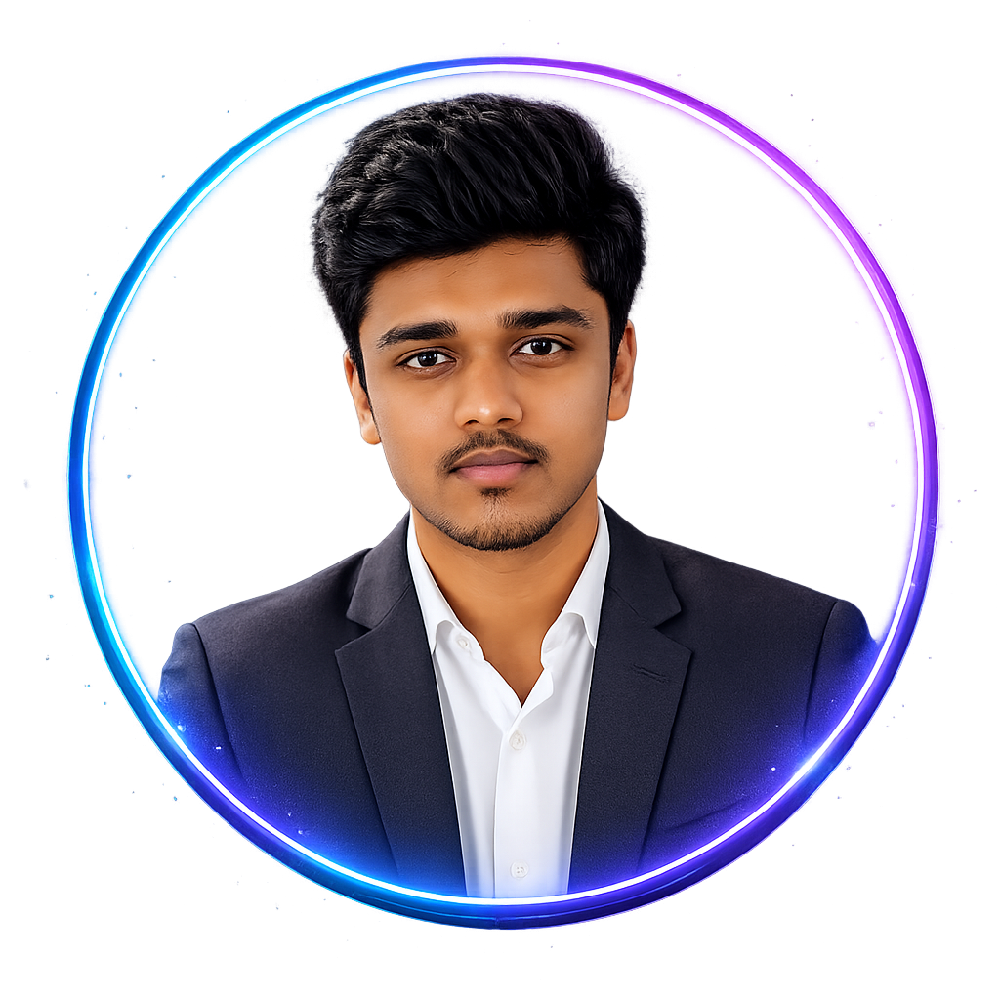

<div align="center">



<br>

# 👋 Hi, I'm LIKESH KANNA**

### 🚀 Applied AI Engineer • AI Agent Developer
<br>


</div>

---

# 🚀 About Me

```python
class LikeshKanna:

    def __init__(self):
        self.name = "Likesh Kanna"
        self.role = "Applied AI Engineer"
        self.education = "B.Tech CSE (AI & ML)"
        self.university = "SRM Institute of Science and Technology"
        self.location = "Tamil Nadu 🇮🇳"

        self.languages = [
            "Python 🐍",
            "Java ☕"
        ]

        self.backend = [
            "Spring Boot 🍃"
        ]

        self.ai = [
            "Machine Learning 🤖",
            "Generative AI ✨",
            "LLMs 🧠",
            "AI Agents ⚡"
        ]

        self.current_focus = [
            "Applied AI 🚀",
            "Backend Development 💻",
            "Open Source ❤️"
        ]

    def motto(self):
        return "Building AI systems that solve real-world problems."
```
---

### 🛠 Skills

<p>


</p>

# 🎓 Education

<div align="center">

| 🎓 Degree | 🏫 University | 🧠 Specialization | 📅 Graduation |
|:---------:|:-------------:|:-----------------:|:-------------:|
| **Bachelor of Technology (B.Tech)** | **SRM Institute of Science and Technology** | **Computer Science & Engineering (Artificial Intelligence & Machine Learning)** | **2028** |

</div>

<br>

<div align="center">


</div>


---


# 🛠 Tech Stack

<div align="center">

<table>

<tr>

<td align="center" width="140">


<br>

<b>Python</b>

</td>

<td align="center" width="140">


<br>

<b>Java</b>

</td>

<td align="center" width="140">


<br>

<b>Spring Boot</b>

</td>

<td align="center" width="140">


<br>

<b>Docker</b>

</td>

</tr>

<tr>

<td align="center">


<br>

<b>Cloud</b>

</td>

<td align="center">


<br>

<b>Database</b>

</td>

<td align="center">


<br>

<b>CPU</b>

</td>

<td align="center">


<br>

<b>GPU</b>

</td>

</tr>

<tr>

<td align="center">


<br>

<b>AI Chip</b>

</td>

<td align="center">


<br>

<b>AI Brain</b>

</td>

<td align="center">


<br>

<b>Neural Nets</b>

</td>

<td align="center">


<br>

<b>AI Agents</b>

</td>

</tr>

</table>

</div>

---


# ⚡ Core Skills

<table>

<tr>
<td>🐍 Python</td>
<td>██████████████░░ 90%</td>
</tr>

<tr>
<td>☕ Java</td>
<td>████████████░░░░ 80%</td>
</tr>

<tr>
<td>🌱 Spring Boot</td>
<td>███████████░░░░░ 75%</td>
</tr>

<tr>
<td>🤖 AI Engineering</td>
<td>██████████████░░ 90%</td>
</tr>

<tr>
<td>🧠 Machine Learning</td>
<td>████████████░░░░ 80%</td>
</tr>

<tr>
<td>💬 LLM Applications</td>
<td>████████████░░░░ 80%</td>
</tr>

<tr>
<td>🚀 AI Agents</td>
<td>███████████░░░░░ 75%</td>
</tr>

</table>

---


# ⚡ Development Environment

<div align="center">


</div>

<br>

<table>

<tr>

<td width="50%" valign="top">

## 💻 Programming

<p>

<br><br>

</p>

---

## 🚀 Backend

<p>

<br><br>

<br><br>

</p>

---

## 🗄 Database

<p>

</p>

</td>

<td width="50%" valign="top">

## 🤖 AI Engineering

<p>

<br><br>

<br><br>

<br><br>

</p>

---

## 🛠 Development Tools

<p>

<br><br>

<br><br>

<br><br>

<br><br>

<br><br>

</p>

</td>

</tr>

</table>

<div align="center">


</div>


---

<div align="center">

### 🚀 Building AI Systems That Solve Real Problems

</div>


# 📊 GitHub Analytics

<div align="center">


</div>


---

# 📈 Contribution Activity

<div align="center">


</div>

---

# 🏆 GitHub Trophies

<p align="center">


</p>

---

# 📅 Contribution Calendar

<div align="center">


</div>

---


# 🐍 Contribution Snake

<div align="center">


</div>


---


## 💡 "Keep Learning. Keep Building. Keep Improving."

</div>


# 📬 Let's Connect

<div align="center">

<a href="mailto:likeshkanna74@gmail.com">

</a>

<a href="https://www.linkedin.com/in/likesh-kanna-77467b30b">

</a>

<a href="https://github.com/Likesh1235">

</a>

</div>

---

# 👀 Profile Statistics

<div align="center">


</div>

---

# 💬 Developer Quote

<div align="center">


</div>

---

# ❤️ Open Source Philosophy

> *"Code is more than syntax—it's a way to solve problems, help people, and keep learning every day."*

---

# 🚀 Current Mission

```text
Learn Continuously
        │
        ▼
Build AI Systems
        │
        ▼
Contribute to Open Source
        │
        ▼
Share Knowledge
        │
        ▼
Grow as an AI Engineer
```

---

<div align="center">

If you enjoy my work, consider following my journey and exploring my repositories.

⭐ Every contribution, idea, and project helps me grow as an engineer.

</div>

---

<div align="center">


### 💙 Thanks for visiting my profile!

**Built with ❤️ by Likesh Kanna**

</div>

<div align="center">


</div>
